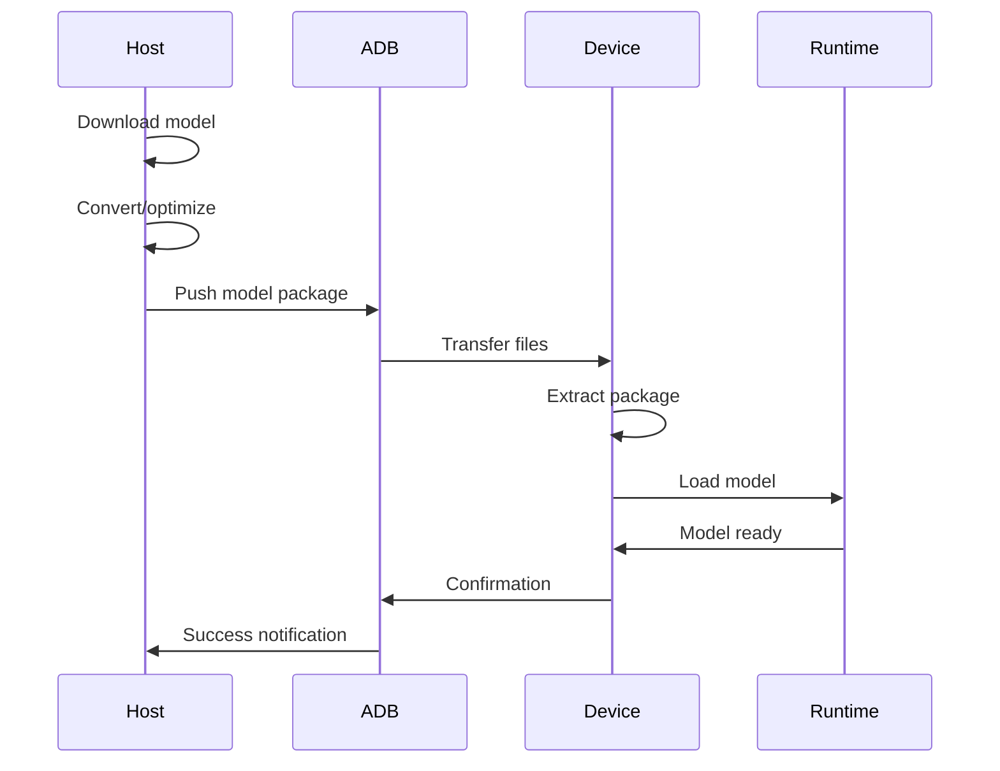
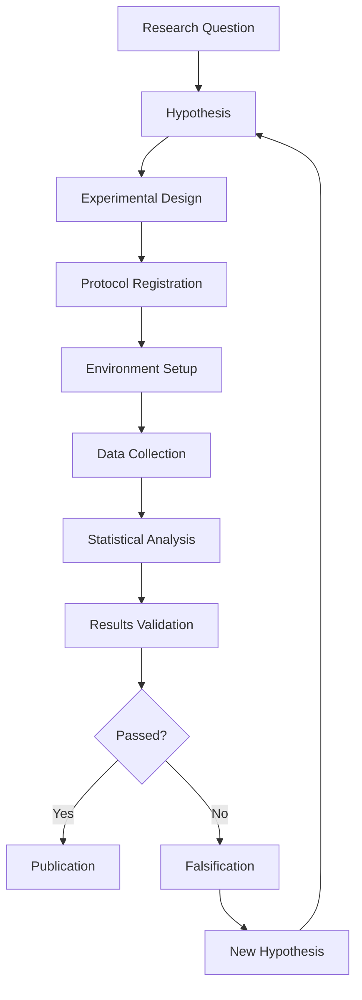

# System Architecture

Complete architectural overview of the Moltar research platform and its components.

## Table of Contents

- [Overview](#overview)
- [Core Architecture](#core-architecture)
- [Component Architecture](#component-architecture)
- [Data Flow](#data-flow)
- [Deployment Architecture](#deployment-architecture)
- [Security Architecture](#security-architecture)
- [Performance Architecture](#performance-architecture)

---

## Overview

Moltar is a comprehensive research platform for deploying and studying AI models on embedded devices, specifically optimized for Motorola mobile hardware.

### Design Principles

- **Research-First**: Everything designed around rigorous scientific methodology
- **Device-Native**: Optimized for mobile hardware constraints
- **Extensible**: Modular architecture for easy expansion
- **Auditable**: Complete traceability and reproducibility

### Key Characteristics

- **Cross-Platform**: Works on multiple Motorola devices
- **Model Agnostic**: Supports various AI model formats
- **Performance Optimized**: Hardware acceleration and optimization
- **Research Focused**: Built-in experimentation and measurement tools

---

## Core Architecture

```
┌─────────────────────────────────────────────────────────────┐
│                    Moltar Research Platform                 │
├─────────────────────────────────────────────────────────────┤
│  ┌─────────────┐ ┌─────────────┐ ┌─────────────────────┐    │
│  │  Research   │ │   Device    │ │   Model & Data      │    │
│  │ Framework   │ │ Management  │ │   Management        │    │
│  └─────────────┘ └─────────────┘ └─────────────────────┘    │
├─────────────────────────────────────────────────────────────┤
│  ┌─────────────┐ ┌─────────────┐ ┌─────────────────────┐    │
│  │ SpaceGhost  │ │   Brack     │ │  Core Services      │    │
│  │ (Optim.)    │ │  (Deploy)   │ │                     │    │
│  └─────────────┘ └─────────────┘ └─────────────────────┘    │
├─────────────────────────────────────────────────────────────┤
│  ┌─────────────────────────────────────────────────────┐    │
│  │              Motorola Device Layer                  │    │
│  └─────────────────────────────────────────────────────┘    │
└─────────────────────────────────────────────────────────────┘
```

### Architectural Layers

#### 1. Research Framework Layer
- **Purpose**: Provides scientific methodology and research tools
- **Components**: Experiment design, data collection, statistical analysis
- **Key Features**: Falsification framework, reproducible protocols

#### 2. Device Management Layer
- **Purpose**: Hardware abstraction and device control
- **Components**: ADB integration, device configuration, monitoring
- **Key Features**: Cross-device compatibility, automated setup

#### 3. Model & Data Management Layer
- **Purpose**: AI model lifecycle and data handling
- **Components**: Model storage, conversion, deployment
- **Key Features**: Multiple format support, optimization pipelines

#### 4. Optimization Layer (SpaceGhost)
- **Purpose**: Performance enhancement and hardware acceleration
- **Components**: ExecuTorch patches, DSP optimization, memory management
- **Key Features**: Hardware-specific tuning, real-time optimization

#### 5. Deployment Layer (Brack)
- **Purpose**: Model deployment and inference execution
- **Components**: Runtime engines, Android integration, monitoring
- **Key Features**: Real-time inference, performance monitoring

#### 6. Core Services Layer
- **Purpose**: Platform infrastructure and utilities
- **Components**: Configuration management, logging, error handling
- **Key Features**: Service orchestration, health monitoring

#### 7. Device Layer
- **Purpose**: Physical hardware interface
- **Components**: Motorola SoC, Android OS, device sensors
- **Key Features**: Hardware acceleration, power management

---

## Component Architecture

### Research Framework Components

```
Research Framework
├── Methodology Engine
│   ├── Experiment Designer
│   ├── Protocol Validator
│   ├── Statistical Analyzer
│   └── Report Generator
├── Data Collection System
│   ├── Metric Collectors
│   ├── Log Aggregators
│   └── Data Validators
└── Quality Assurance
    ├── Test Frameworks
    ├── Validation Suites
    └── Compliance Checkers
```

### Device Management Components

```
Device Management
├── Connection Manager
│   ├── ADB Interface
│   ├── USB Handler
│   └── Network Bridge
├── Configuration System
│   ├── Device Profiles
│   ├── Capability Detection
│   └── Parameter Optimization
└── Monitoring System
    ├── Performance Trackers
    ├── Health Checkers
    └── Alert Managers
```

### Model Management Components

```
Model Management
├── Model Registry
│   ├── Format Handlers
│   ├── Version Control
│   └── Metadata Store
├── Conversion Pipeline
│   ├── Format Converters
│   ├── Optimization Passes
│   └── Validation Checks
└── Deployment System
    ├── Runtime Selectors
    ├── Resource Allocators
    └── Lifecycle Managers
```

---

## Data Flow

### Research Workflow Data Flow

```
Research Question
        ↓
Hypothesis Formation
        ↓
Experimental Design
        ↓
Protocol Registration
        ↓
Data Collection
        ↓
Statistical Analysis
        ↓
Results Validation
        ↓
Publication/Archival
```

### Model Deployment Data Flow

```
Model Source (HuggingFace)
        ↓
Model Download & Validation
        ↓
Format Conversion (GGUF/PTE)
        ↓
Optimization (SpaceGhost)
        ↓
Deployment Package Creation
        ↓
Device Transfer (ADB)
        ↓
Runtime Loading (Brack)
        ↓
Inference Execution
        ↓
Performance Monitoring
        ↓
Results Collection
```

### Device Interaction Data Flow

```
Host Command
        ↓
ADB Transport Layer
        ↓
Android Shell/Command Processor
        ↓
Device System Calls
        ↓
Hardware Abstraction Layer
        ↓
SoC Components (CPU/GPU/DSP)
        ↓
Physical Hardware
```

---

## Deployment Architecture

### Single Device Deployment

```
Host Machine (macOS/Linux/Windows)
    ├── Development Environment
    │   ├── Python Runtime
    │   ├── Android SDK
    │   └── Research Tools
    └── Build System
        ├── Model Converters
        ├── Optimization Tools
        └── Package Builders

    ↕️ ADB Connection

Motorola Device (Android)
    ├── System Layer
    │   ├── Android OS
    │   ├── Hardware Abstraction
    │   └── System Services
    └── Research Layer
        ├── Runtime Engines
        │   ├── ExecuTorch
        │   ├── GGUF Runtime
        │   └── Custom Kernels
        └── Research Applications
            ├── Brack (Deployment)
            ├── SpaceGhost (Optimization)
            └── Monitoring Tools
```

### Multi-Device Research Setup

```
Research Lab Network
    ├── Host Machines (Development)
    │   ├── Build Servers
    │   ├── Test Automation
    │   └── Data Analysis
    ├── Device Farm
    │   ├── Motorola Devices
    │   │   ├── moto g power 5G (Primary)
    │   │   ├── moto g stylus (Secondary)
    │   │   └── Other Motorola models
    │   └── Reference Devices
    │       ├── Snapdragon 480 reference
    │       └── MediaTek reference
    └── Data Infrastructure
        ├── Result Databases
        ├── Log Aggregation
        └── Performance Analytics
```

---

## Security Architecture

### Research Data Security

```
Data Security Layers
├── Access Control
│   ├── User Authentication
│   ├── Permission Levels
│   └── Audit Logging
├── Data Protection
│   ├── Encryption at Rest
│   ├── Transport Security
│   └── Secure Deletion
└── Compliance Framework
    ├── Research Ethics
    ├── Data Privacy
    └── Regulatory Compliance
```

### Device Security

```
Device Security Measures
├── Connection Security
│   ├── ADB Authentication
│   ├── USB Verification
│   └── Network Encryption
├── Runtime Security
│   ├── Sandboxing
│   ├── Resource Limits
│   └── Crash Protection
└── Research Security
    ├── Experiment Isolation
    ├── Data Containment
    └── Incident Response
```

---

## Performance Architecture

### Hardware Acceleration Architecture

```
Performance Optimization Stack
├── Application Layer
│   ├── Model Selection
│   ├── Runtime Configuration
│   └── Workload Optimization
├── Runtime Layer
│   ├── ExecuTorch Engine
│   ├── GGUF Runtime
│   └── Custom Kernels
├── System Layer
│   ├── Android Performance APIs
│   ├── Hardware Abstraction
│   └── Power Management
└── Hardware Layer
    ├── MediaTek MT6855V
    │   ├── 8x ARM Cortex-A55 CPU
    │   ├── ARM Mali-G52 GPU
    │   ├── AI Processing Unit
    │   └── LPDDR4X Memory
    └── Snapdragon 480 (Target)
        ├── 8x Kryo 460 CPU
        ├── Adreno 619 GPU
        ├── Hexagon 686 DSP
        └── LPDDR4X Memory
```

### Memory Management Architecture

```
Memory Management System
├── Application Memory
│   ├── Model Storage
│   ├── Runtime Buffers
│   └── Working Memory
├── System Memory
│   ├── Android System
│   ├── Background Services
│   └── Cache Management
└── Optimization Strategies
    ├── Memory Pooling
    ├── Garbage Collection
    ├── Memory Mapping
    └── Compression Techniques
```

### Performance Monitoring Architecture

```
Monitoring & Analytics
├── Real-time Metrics
│   ├── Latency Tracking
│   ├── Memory Usage
│   ├── CPU Utilization
│   └── Battery Consumption
├── Performance Profiling
│   ├── Hardware Counters
│   ├── Software Instrumentation
│   └── Benchmark Suites
└── Analytics Pipeline
    ├── Data Collection
    ├── Statistical Analysis
    ├── Visualization Tools
    └── Report Generation
```

---

## Component Interaction Diagrams

### Model Deployment Sequence



### Research Experiment Flow



---

## Scalability Considerations

### Horizontal Scaling
- **Device Pools**: Multiple Motorola devices for parallel testing
- **Distributed Computing**: Cross-device model training and evaluation
- **Load Balancing**: Automatic workload distribution across available hardware

### Vertical Scaling
- **Memory Optimization**: Efficient model loading and inference
- **Performance Tuning**: Hardware-specific optimizations
- **Resource Management**: Dynamic allocation based on requirements

### Future Extensibility
- **New Device Support**: Easy addition of new Motorola models
- **Model Format Support**: Pluggable architecture for new AI formats
- **Research Tools**: Extensible framework for new experimental methods

---

*This architecture provides a solid foundation for rigorous AI research on mobile devices while maintaining flexibility for future enhancements and new research directions.*